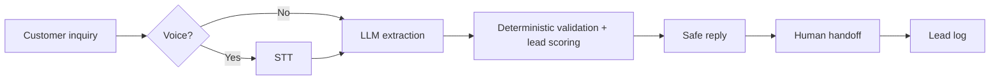

# PackLead

A Google ADK-based lead intake and qualification assistant for
BLRPackworks, a Peenya-based custom corrugated and printed packaging
manufacturer serving D2C brands, e-commerce sellers, food brands, and
industrial customers.

The company handles:

- corrugated shipping boxes
- custom printed cartons
- food-grade packaging inquiries
- e-commerce packaging
- industrial packaging

## Business Problem

The owner or sales team receives leads from IndiaMART, Justdial, WhatsApp,
website forms, and phone inquiries. Each lead has to be read, understood,
qualified, and followed up manually. Many messages are vague, incomplete,
urgent, or price-focused, so the team wastes time on weak leads and risks
making unsafe commitments too early.

## Normal Human Workflow

1. Read the customer message or phone transcript.
2. Identify the product type and use case.
3. Ask product-specific follow-up questions.
4. Avoid quoting until dimensions, material, quantity, and delivery details are clear.
5. Prioritize urgent or bulk leads.
6. Call the customer when pricing, delivery, feasibility, or final quotation needs human judgment.

## Architecture



The LLM is used for messy language understanding and field extraction.
Deterministic code is used for scoring, missing fields, safety checks, handoff
decisions, and the local JSONL lead log. A human handles pricing, delivery
commitments, discounts, feasibility, and final quotation.

The local UI streams these steps over WebSocket so the process is visible in the
browser.

```text
Browser UI
↓
WebSocket /ws
↓
Extraction event
↓
Validation / lead score events
↓
Assistant response chunks
↓
Handoff + lead log events
```

## Product-Specific Qualification

The deterministic tool asks different questions by product type:

- Corrugated box: length x width x height, quantity, ply, BF/GSM or material strength, product weight, delivery location.
- Printed carton: dimensions, quantity, paperboard/GSM, print colors, finish/lamination, artwork readiness, delivery location.
- Food packaging: dimensions, quantity, food-grade requirement, moisture/oil barrier requirement, certification concern if mentioned, delivery location.
- E-commerce shipping: product weight, fragility, approximate shipment volume, branding/printing need, box dimensions, delivery location.
- Industrial packaging: product type, product weight, dimensions, handling/storage requirement, quantity, delivery location.

The assistant asks only the next best 3-4 questions instead of dumping every
missing field on the customer.

## Human Handoff Rules

The assistant hands off when:

- the customer asks for price or quotation
- the customer asks for delivery, stock, discount, or final commitment
- the lead is hot
- the inquiry is urgent
- quote details are complete and ready for human review
- extraction confidence is low
- the request is outside known capabilities

Handoff triggers are explicit:

- `price_request`
- `urgent_timeline`
- `hot_lead`
- `delivery_commitment`
- `low_confidence`
- `unsupported_request`
- `complete_quote_ready`
- `none`

## Safety Rules

The assistant must not invent prices, promise delivery dates, claim inventory,
offer discounts, finalize quotations, send external messages, or pretend a human
approved anything. A customer budget is captured as context, not treated as an
approved price.

## Local Lead Log

Every qualification call writes one JSONL record to `lead_log.jsonl` by default.
This is intentionally not a CRM. Each record includes:

- timestamp
- source
- raw message
- extracted lead
- lead status
- extraction confidence
- handoff required
- handoff trigger
- handoff summary

## Configurability

The business is configured in:

```text
config/business_config.json
```

The config defines the business profile, lead sources, product categories,
product-specific required fields, scoring thresholds, handoff triggers, safety
constraints, response templates, and human scripts.

For similar MSMEs, the same approach can be adapted by changing:

- product catalog
- required fields
- missing-field rules
- lead scoring thresholds
- handoff triggers
- safe response rules
- human handoff script
- source-specific behavior

A documentation-only example exists at:

```text
config/similar_msme_config_example.json
```

## Project Structure

```text
packlead/
  packlead/
    __init__.py
    agent.py
    config_loader.py
    pipeline.py
    tools.py
  config/
    business_config.json
    similar_msme_config_example.json
  eval/
    test_cases.json
  tests/
    test_lead_qualification.py
  demo.py
  eval.py
  ui.py
  PLAYBOOK.md
  demo_output.md
  sample_inputs.md
  .env.sample
  pyproject.toml
  README.md
```

## Run Locally

Deterministic demo without an LLM:

```bash
python demo.py
```

Tests:

```bash
python -m pytest tests
```

WebSocket text + voice demo UI:

```bash
python ui.py
```

Open `http://127.0.0.1:8765`.

The UI demonstrates the process in one screen:

```text
Customer Inquiry
↓
AI Extraction
↓
Deterministic Validation + Lead Scoring
↓
Safe Customer Response
↓
Human Handoff Summary
↓
Local Lead Log
```

WebSocket endpoint:

```text
ws://127.0.0.1:8765/ws
```

Text payload example:

```json
{
  "type": "text",
  "source": "IndiaMART",
  "message": "Hi, I need 5000 custom printed boxes for my skincare brand in Bangalore. Need delivery next week."
}
```

Voice flow:

- Click `Record Voice`.
- Browser captures microphone audio.
- Audio is sent to the backend over WebSocket.
- Backend sends the audio to Gemini for transcription when `GOOGLE_API_KEY` is configured.
- If Gemini transcription is unavailable or fails, browser speech recognition/manual transcript edit is used as fallback.
- Click `Process Voice Transcript`.
- The transcript and audio metadata are sent through WebSocket and processed by
  the same lead pipeline.
- Optional browser TTS can read the assistant reply aloud when the `Read
  assistant reply aloud` checkbox is enabled.

For local development, `ui.py` attempts Gemini text extraction when
`GOOGLE_API_KEY` is configured. If Gemini is unavailable, it falls back to
lightweight extraction heuristics so the local flow can still run without credentials.
In both paths, deterministic code handles scoring, missing fields, safety, and
handoff.

Current AI/STT/TTS status:

- WebSocket UI extraction: Gemini text extraction when `GOOGLE_API_KEY` is
  configured, with stable demo heuristics in `packlead/pipeline.py`
  as fallback.
- ADK/Gemini extraction: supported separately through `packlead/agent.py`
  when API credentials are configured.
- WebSocket UI and ADK agent are separate entry points, but both use Gemini for
  messy language understanding when configured and both use the same
  deterministic qualification tool after extraction.
- Voice STT: browser microphone capture is sent to the backend; backend tries
  Gemini audio transcription with `GOOGLE_API_KEY`; browser Web Speech
  API/manual transcript edit is the fallback.
- TTS: optional browser Web Speech Synthesis only.
- Production STT/TTS would use Gemini audio, Google Speech-to-Text, Deepgram,
  Whisper, or a similar provider.

Evaluation metrics:

```bash
python eval.py
```

This prints per-case pass/fail and aggregate metrics for product classification,
lead status, handoff decision, handoff trigger, missing fields, safety
violations, task completion, containment, human handoff rate, fallback/low
confidence rate, processing latency, and voice flow completion.

The current eval is a controlled baseline against deterministic demo extraction
and business-rule code. It is not a claim of real-world LLM or production STT
performance.

ADK agent:

```bash
uv sync
cp .env.sample .env
```

Fill in either `GOOGLE_API_KEY` or Vertex AI settings in `.env`, then run:

```bash
uv run adk run packlead
```

For Gemini API key mode, `.env` should include:

```env
GOOGLE_GENAI_USE_VERTEXAI=false
GOOGLE_API_KEY=your-api-key
GEMINI_TEXT_MODEL=gemini-2.5-flash
GEMINI_TRANSCRIPTION_MODEL=gemini-2.5-flash
```

The same `GOOGLE_API_KEY` is used server-side for both:

- ADK/Gemini agent calls.
- Gemini audio transcription in the WebSocket voice demo.

The API key is never sent to frontend JavaScript.

Verify Gemini text + audio transcription:

```bash
python verify_gemini.py --audio path/to/short_voice_sample.webm
```

Use a short audio file containing speech. The script reads `GOOGLE_API_KEY` from
`.env`, makes one Gemini text call, then sends the audio to Gemini for
transcription. Both calls happen server-side.

Or use the ADK web UI:

```bash
uv run adk web
```

Then select `packlead`.

## ADK Base Pattern

The assistant follows the Python `customer-service` sample's conceptual base:
a single customer-facing root agent with function tools and safety constraints.
The project structure stays closer to the simpler `fun-facts` sample to avoid
unnecessary CRM, cart, live video, and multimodal complexity.

## Current Limitations

- Text and local voice input are supported; there is no real phone-call integration.
- No real WhatsApp, IndiaMART, Justdial, website, or phone integration.
- No pricing engine.
- No delivery feasibility or inventory lookup.
- No CRM or database beyond the local JSONL lead log.
- The local WebSocket UI uses Gemini text extraction when configured and falls
  back to heuristics if the API is unavailable.
- The local UI is an operator surface for testing the intake flow, not a SaaS dashboard or CRM.
- Voice capture is real browser microphone capture. The backend can use Gemini
  audio transcription with `GOOGLE_API_KEY`; browser speech recognition/manual
  transcript edit remains the fallback.
- TTS is browser Web Speech Synthesis only, not production TTS.
- Voice support is local browser capture plus server-side transcription, not production call-center infrastructure.
- The ADK agent remains a separate entry point for the ADK console.
